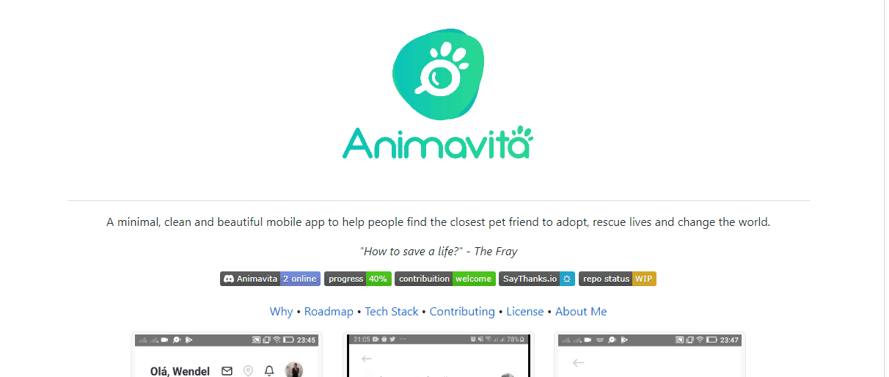

# Projeto com README
Minha primeira tarefa com um arquivo README.

[]

## Tecnologias utilizadas:
- HTML;
- CSS:
- JS;

## Como utilizar:

1 - Clone o projeto
```
git clone <https://github.com/Moiseis-Cruz/repositorio-com-readme.git>
```

2 - Acesse a pasta do projeto
````
cd repositorio-com-readme
````